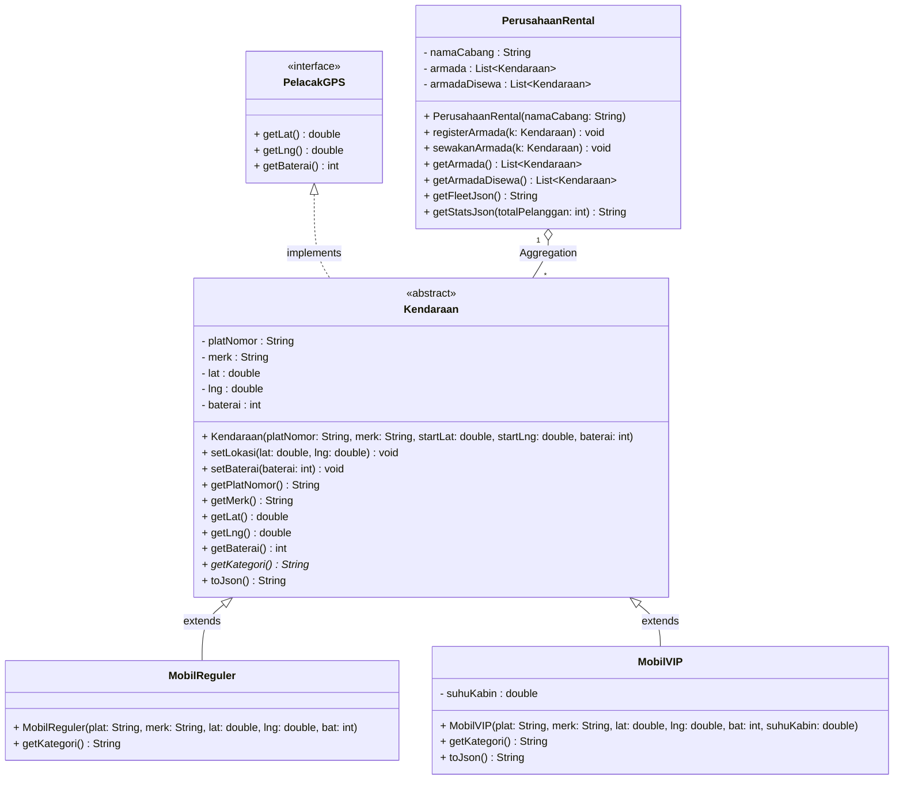

```mermaid
classDiagram
    class PelacakGPS {
        <<interface>>
        + getLat() double
        + getLng() double
        + getBaterai() int
    }

    class Kendaraan {
        <<abstract>>
        - platNomor : String
        - merk : String
        - lat : double
        - lng : double
        - baterai : int
        + Kendaraan(platNomor: String, merk: String, startLat: double, startLng: double, baterai: int)
        + setLokasi(lat: double, lng: double) void
        + setBaterai(baterai: int) void
        + getPlatNomor() String
        + getMerk() String
        + getLat() double
        + getLng() double
        + getBaterai() int
        + getKategori()* String
        + toJson() String
    }
    PelacakGPS <|.. Kendaraan : implements

    class MobilReguler {
        + MobilReguler(plat: String, merk: String, lat: double, lng: double, bat: int)
        + getKategori() String
    }
    Kendaraan <|-- MobilReguler : extends

    class MobilVIP {
        - suhuKabin : double
        + MobilVIP(plat: String, merk: String, lat: double, lng: double, bat: int, suhuKabin: double)
        + getKategori() String
        + toJson() String
    }
    Kendaraan <|-- MobilVIP : extends

    class PerusahaanRental {
        - namaCabang : String
        - armada : List~Kendaraan~
        - armadaDisewa : List~Kendaraan~
        + PerusahaanRental(namaCabang: String)
        + registerArmada(k: Kendaraan) void
        + sewakanArmada(k: Kendaraan) void
        + getArmada() List~Kendaraan~
        + getArmadaDisewa() List~Kendaraan~
        + getFleetJson() String
        + getStatsJson(totalPelanggan: int) String
    }
    PerusahaanRental "1" o-- "*" Kendaraan : Aggregation
```
