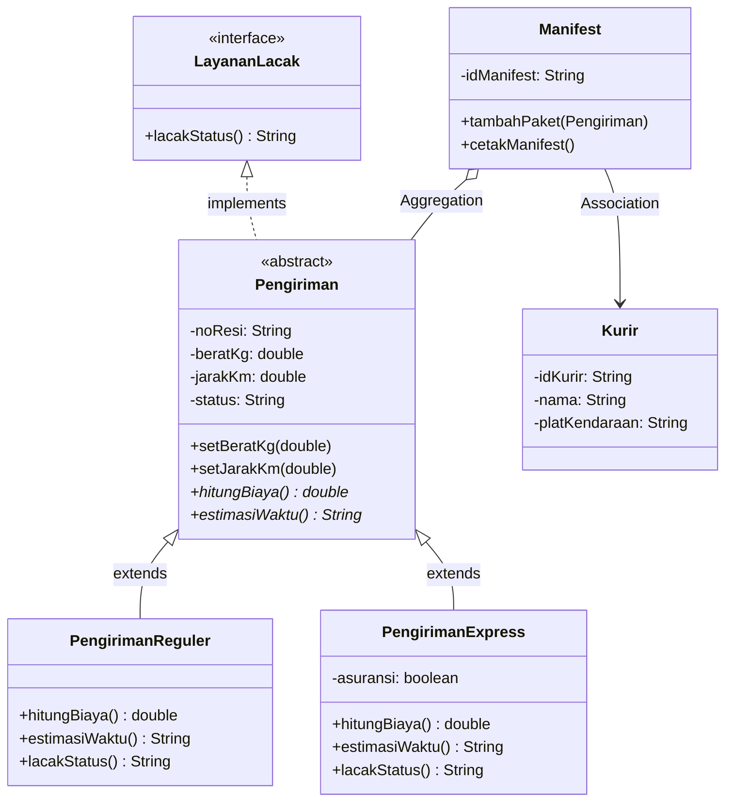

```mermaid
classDiagram
    class LayananLacak {
        <<interface>>
        +lacakStatus() String
    }
    
    class Pengiriman {
        <<abstract>>
        -noResi: String
        -beratKg: double
        -jarakKm: double
        -status: String
        +setBeratKg(double)
        +setJarakKm(double)
        +hitungBiaya()* double
        +estimasiWaktu()* String
    }
    
    LayananLacak <|.. Pengiriman : implements
    
    class PengirimanReguler {
        +hitungBiaya() double
        +estimasiWaktu() String
        +lacakStatus() String
    }
    
    class PengirimanExpress {
        -asuransi: boolean
        +hitungBiaya() double
        +estimasiWaktu() String
        +lacakStatus() String
    }
    
    Pengiriman <|-- PengirimanReguler : extends
    Pengiriman <|-- PengirimanExpress : extends
    
    class Kurir {
        -idKurir: String
        -nama: String
        -platKendaraan: String
    }
    
    class Manifest {
        -idManifest: String
        +tambahPaket(Pengiriman)
        +cetakManifest()
    }
    
    Manifest --> Kurir : Association
    Manifest o-- Pengiriman : Aggregation
```
